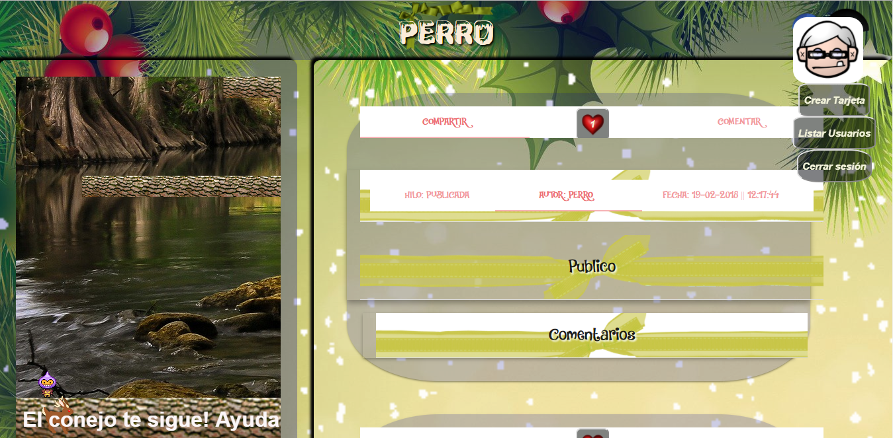

# TarjetasFelicitaciones
Proyecto web en el que podrás crear tarjetas de felicitaciones y programar una fecha para mandarla a un amigo.

  <h2>Iniciar sesión</h2>
  
  <h2>Página de inicio</h2>
  
  <h2>Borrador(versión admin)</h2>
  
  <h2>Dialogo borrartarjeta</h2>
  
  <h2>Tarjetas publicadas</h2>
  
  <h2>Administración de usuarios y mensajes</h2>
  

